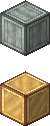
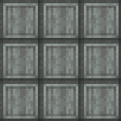
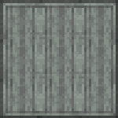
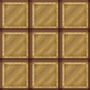
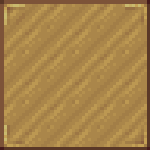

Also check my other CTM packs (click on the badges to follow the links) :

## Adds connected textures with the textures of the Create mod (Continuity or Optifine are required for the resource pack to work)

| Supported MC Version  | Up to date |
|:---------------------:|:----------:|
|       `1.17.x`        |     ❌     |
|       `1.18.x`        |     ✅     |
|       `1.19.2`        |     ✅     |
|       `1.19.3`        |     ❌     |
|       `1.19.4`        |     ❌     |
|       `1.20.x`        |     ❌     |

## Blocks done

***

## Here are some visual examples of what this pack does

> Left is what a 3x3 area of blocks looks like in vanilla, and right is with the texture pack

> If you find an issue with this pack, please open an issue on the Github repo of this resource pack
>
>
>
> If you have a suggestion, you can go on my discord server and create a post in 🗽-suggestions-forum
>
> 

***

### Check out the rest of my projects !

