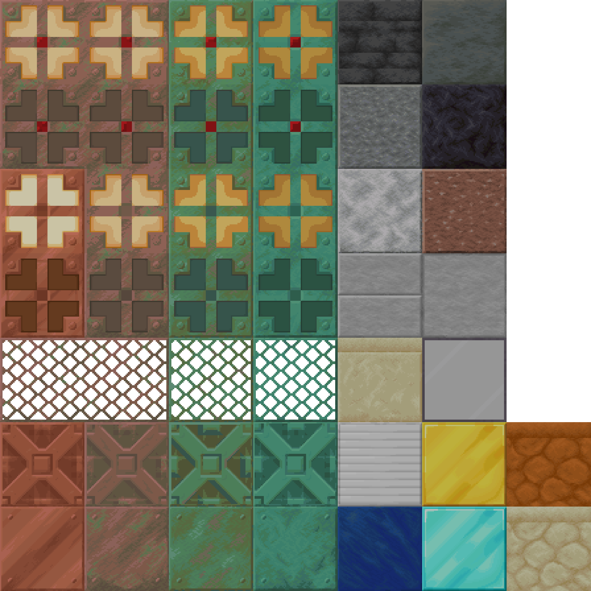
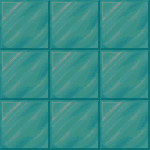
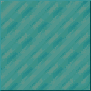
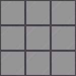

#

 

## Adds connected textures to the game but with Faithful textures (works with Optifine and Continuity)

> This pack adds connected textures to blocks like gold block, sea lanterns (see gallery), but with Faithful 64x textures.
>
> The pack is based on their textures so here is the link to comply with their license : <https://faithfulpack.net>

| Supported MC Version  | Up to date |
|:---------------------:|:----------:|
|       `1.17.x`        |     ✅     |
|       `1.18.x`        |     ✅     |
|       `1.19.x`        |     ✅     |
|       `1.20.x`        |     ✅     |

## Blocks done

> Copper blocks are present in both normal and waxed states

## Here are some visual examples of what this pack does

> Left is what a 3x3 area of blocks looks like in vanilla, and right is with the texture pack

> If you find an issue with this pack, open an issue on the Github repo of this
> resource pack or go on the discord and create a post in issues-and-suggestion
>
> 
