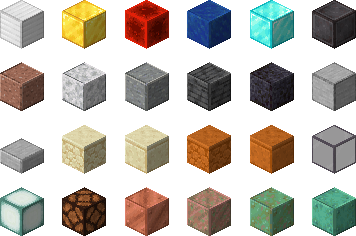
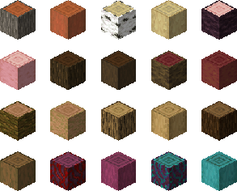
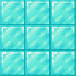
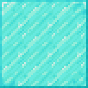
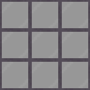
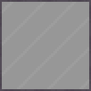

#

 

Also check my other CTM packs (click on the badges to follow the links) :

[-a93f00?style=for-the-badge&logo=modrinth)](https://modrinth.com/resourcepack/ctm-create)

## Adds connected textures to the game (works with Optifine and Continuity)

| Supported MC Version  | Up to date |
|:---------------------:|:----------:|
|       `1.17.x`        |     ✅     |
|       `1.18.x`        |     ✅     |
|       `1.19.x`        |     ✅     |
|       `1.20.x`        |     ✅     |

## Blocks done

> The redstone lamp and the copper blocks are included in all their respective states (on/off, waxed, ...)
>
> All the log/stem types are included

 ____ 

***

## Here are some visual examples of what this pack does

> Left is what a 3x3 area of blocks looks like in vanilla, and right is with the texture pack

> If you find an issue with this pack, please open an issue on the Github repo of this resource pack
>
>
>
> If you have a suggestion, you can go on my discord server and create a post in 🖍️-suggestion
>
> 
