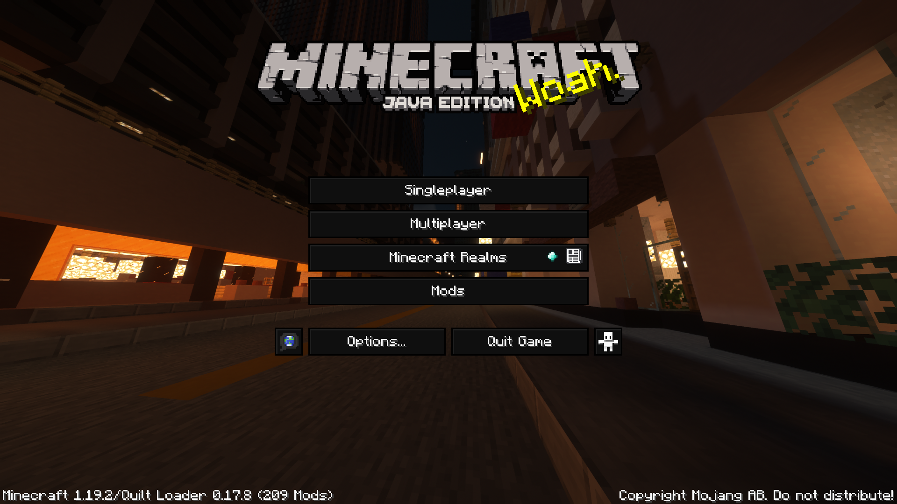

| Supported MC Version  | Up to date |
|:---------------------:|:----------:|
|       `1.17.x`        |     ❌     |
|       `1.18.x`        |     ✅     |
|       `1.19.x`        |     ✅     |
|       `1.20.x`        |     ✅     |

> Adds a smooth dark GUI to every container and screen in the game

## Mods compatibility

|   Mods   | CTM Selector | Entity Textures Features | Inventory Tabs | Iris | ItemSwapper | ModMenu |
|:--------:|:------------:|:------------------------:|:--------------:|:----:|:-----------:|:-------:|
| `1.17.x` |      ❌       |            ❌             |       ❌        |  ❌   |      ❌      |    ❌    |
| `1.18.x` |      ✅       |            ✅             |       ✅        |  ✅   |      ✅      |    ✅    |
| `1.19.x` |      ✅       |            ✅             |       ✅        |  ✅   |      ✅      |    ✅    |
| `1.20.x` |      ✅       |            ✅             |       ✅        |  ✅   |      ✅      |    ✅    |

***

> If you find an issue with this pack, please open an issue on the Github repo of this resource pack
>
>
>
> If you have a suggestion, you can go on my discord server and create a post in 🗽-suggestions-forum
>
> 
